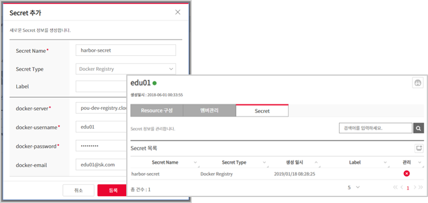

# Step 01

CI/CD Pipeline 설정

## Create Harbor Project

1. Left menu > Image Registry 클릭
2. Harbor Login (계정이 없을 경우 생성)

   

3. 좌측 메뉴에서 Projects > NEW PROJECT 클릭
   
4. Project Name 입력 후 OK 클릭 (Project 명은 Docker Image 명의 Namespace 로 사용됨)
   
   

## Create Kubernetes Secret
> K8S Secret  Harbor로부터 Docker Image를 받기위해 필요한 권한 Token임.
> 
1. Left menu > 네임스페이스 > 자신의 namespace 선택

2. Secret 탭 선택 > Secret 추가 버튼 클릭

   

3. Secret Name 입력, Secret Type Docker Registry 선택

4. Docker-server, docker-username, docker-password, docker-email 입력 후 등록

   

## Set up Jenkins